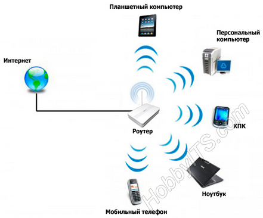
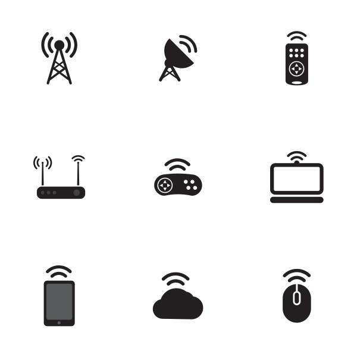
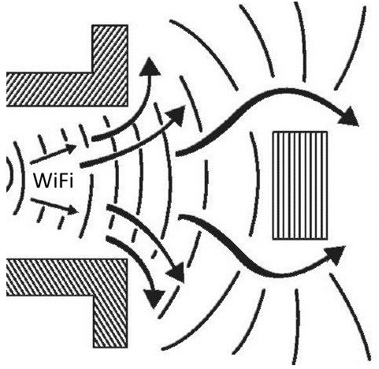
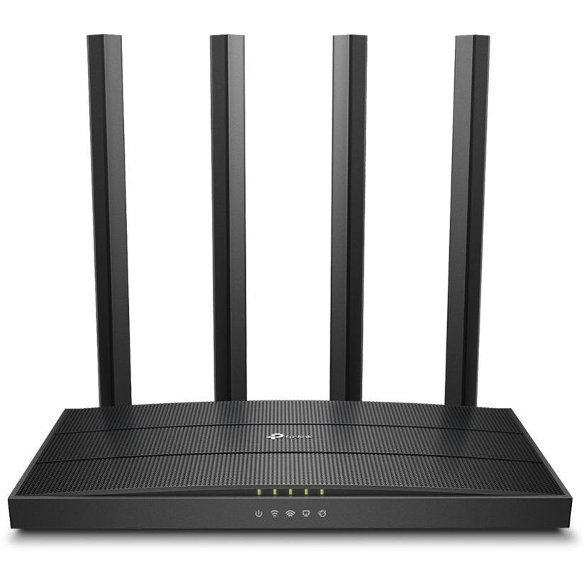

Список исполнителей
-------------------

*   Салий Валерия Романовна

Студент 1 курса факультета высшей школы аэронавигации ФГБОУ ВО «Санкт-Петербургский государственный университет гражданской авиации имени Главного маршала авиации А.А. Новикова»

E-mail: lerasaliy@mail.ru

Реферат
-------

Сведения об объеме: основная часть отчета с введением и заключением – 18 страниц, 4 рисунка, 5 глав, 3 использованных источника.

Ключевые слова: беспроводная связь, мобильность, Wi-Fi, интернет.

Объектом исследования являются мобильные технологии беспроводной связи.

Предметом исследования является – технология Wi-Fi.

Цель работы заключается анализе мобильных технологий беспроводной связи.

Задачи работы:

1.  Ознакомиться с историей и физической сущностью беспроводной связи;
2.  Выявить плюсы и минусы Wi-Fi;
3.  Выяснить количество видов беспроводного интернета, а также влияние на здоровье человека.

В ходе исследования были использованы теоретические методы: анализ, аналогия, индукция и практические методы: измерение, сравнение, обобщение.

Область применения: коммуникация устройств в малом масштабе, например: в домах, торговых центрах, на площадях и т. д.

Значимость: объединение устройств в единую систему, с помощью которой ими можно управлять; беспроводной выход в интернет

Определения
-----------

Ethernet - семейство технологий пакетной передачи данных между устройствами для компьютерных и промышленных сетей.

Wi-Fi - технология беспроводной локальной сети с устройствами.

PAN - сеть передачи данных, объединяющая персональные электронные устройства одного пользователя (телефоны, карманные персональные компьютеры, смартфоны, ноутбуки, беспроводные гарнитуры и т. п.)

WWAN - беспроводная глобальная вычислительная сеть, разновидность беспроводных компьютерных сетей для доступа в интернет.

IP - маршрутизируемый протокол сетевого уровня

Интернет – Всемирная информационная компьютерная сеть, связывающая между собой как пользователей компьютерных сетей, так и пользователей индивидуальных компьютеров для обмена информацией.

Обозначения и сокращения
------------------------

Wi-Fi – Wireless Fidelity

WLAN – Wireless Local Area Network

PAN – Personal Area Network

WWAN – Wireless Wide Area Network

IP – Internet Protocol

КПК – Компактный персональный компьютер

ЭИИМ – Эквивалентная изотропно-излучаемая мощность

ВВЕДЕНИЕ
--------

В нашей стране большую распространенность получили районные Ethernet сети, затягивающие в квартиру витую пару. Когда дома всего один компьютер, вопросов с подключением кабеля обычно не возникает. Но когда появляется желание проводить время в Интернете с компьютера и других устройств с возможностью беспроводного подключения, приходится задуматься о том, как все это грамотно осуществить.

На современном этапе развития сетевых технологий, технология беспроводных сетей Wi-Fi является наиболее удобной в условиях, требующих мобильность, простоту установки и использования. Wi-Fi (от англ. wireless fidelity - беспроводная связь) - стандарт широкополосной беспроводной связи семейства. Как правило, технология Wi-Fi используется для организации беспроводных локальных компьютерных сетей, а также создания так называемых горячих точек высокоскоростного доступа в Интернет. беспроводной связь Wi-Fi

Актуальность темы:

На наш взгляд актуальность использования беспроводного интернета возрастает. Таким образом, возрастает и число пользователей беспроводного интернета. В связи с этим данная реферативная работа позволит пользователям стать более компетентными при эксплуатации беспроводной связи.

Цель работы:

1.  Ознакомиться с историей и физической сущностью беспроводной связи;
2.  Выявить плюсы и минусы Wi-Fi;
3.  Выяснить количество видов беспроводного интернета, а также влияние на здоровье человека.

1\. ИСТОРИЯ БЕСПРОВОДНОЙ СВЯЗИ
------------------------------

Когда Герцу удалось получить электромагнитные волны. Т.е. электрический заряд не просто сместился из одной точки в другую, а приведен в быстрые колебания вдоль некоторой прямой, так что он движется подобно грузу, подвешенному на пружинке, но только намного быстрее. Тогда электрическое поле в непосредственной близости от заряда начнет периодически изменяться. Период этих изменений, очевидно, будет равен периоду колебаний заряда. Электрическое поле будет порождать периодически меняющееся магнитное поле, а последнее в свою очередь вызывает появление переменного электрического поля, уже на большем расстоянии от заряда, и т.д.

Для получения электромагнитных волн Г. Герц использовал простое устройство, называемое сейчас вибратором Герца. К открытому контуру можно перейти от закрытого, если постепенно раздвигать пластины конденсатора, уменьшая их площадь и одновременно уменьшая число витков в катушке. В конце концов, получится просто прямой провод. Это и есть открытый колебательный контур. Емкость и индуктивность вибратора Герца малы. Поэтому частота колебаний весьма велика.

Рисунок 1. Логотип Wi-Fi

В открытом контуре заряды не сосредоточены на концах, а распределены по всему проводнику. Ток в данный момент времени во всех сечениях проводника направлен в одну и ту же сторону, но сила тока неодинакова в различных сечениях проводника. На концах она равна нулю, а посредине достигает максимума (в обычных же цепях переменного тока сила тока во всех сечениях в данный момент времени одинакова.) Электромагнитное поле также охватывает все пространство возле контура.

Опыты Герца заинтересовали физиков всего мира. В России одним из первых занялся изучением электромагнитных волн преподаватель офицерских курсов в Кронштадте Александр Степанович Попов. Это была первая попытка создания беспроводной связи в России.

В качестве детали, непосредственно «чувствующей» электромагнитные волны, А.С. Попов применил когерер. Этот прибор представляет собой стеклянную трубку с двумя электродами. В трубке помещены мелкие металлические опилки. Действие прибора основано на влиянии электрических разрядов на металлические порошки. В обычных условиях когерер обладает большим сопротивлением, так как опилки имеют плохой контакт друг с другом. Пришедшая электромагнитная волна создает в когерере переменный ток высокой частоты. Между опилками проскакивают мельчайшие искорки, которые спекают опилки. В результате сопротивление когерера резко падает (в опытах А. С. Попова со 100000 до 1000 - 500 Ом, т. е. в 100 -- 200 раз). Снова вернуть прибору большое сопротивление можно, если встряхнуть его. Чтобы обеспечить автоматичность приема, необходимую для осуществления беспроволочной связи, А. С. Попов использовал звонковое устройство для встряхивания когерера после приема сигнала. Цепь электрического звонка замыкалась с помощью чувствительного реле в момент прихода электромагнитной волны. С окончанием приема волны работа звонка сразу прекращалась, так как молоточек звонка ударял не только по звонковой чашечке, но и по когереру. С последним встряхиванием когерера аппарат был готов к приему новой волны.

С момента изобретения радио Поповым прошло некоторое время, когда люди захотели вместо телеграфных сигналов, состоящих из коротких и длинных сигналов, передавать речь и музыку. Так была изобретена радиотелефонная связь.

2\. БЕСПРОВОДНЫЕ СЕТЕВЫЕ ТЕХНОЛОГИИ
-----------------------------------

Разделить один Интернет-канал на всех пользователей нам помогают многофункциональные роутеры. Потребность в создании дома персональной WI-FI сети испытывает, наверное, любой обладатель ноутбука или компактного персонального компьютера (КПК). Конечно, можно купить точку доступа и организовать беспроводный доступ через нее. Но куда удобнее иметь устройство «всё в одном», ведь роутеры справляются с этой функцией не хуже точек доступа. Главное, на что стоит обращать внимание, это поддерживаемые стандарты Wi-fi. Обычно беспроводные сетевые технологии группируются в три типа, различающиеся по масштабу действия их радиосистем, но все они с успехом эксплуатируются.

PAN (персональные сети) - короткодействующие, радиусом до 10 м сети, которые связывают персональный компьютер (ПК) и другие устройства - КПК, мобильные телефоны, принтеры и т. п. С помощью таких сетей реализуется простая синхронизация данных, устраняются проблемы с обилием кабелей в офисах, реализуется простой обмен информацией в небольших рабочих группах. Наиболее перспективный стандарт для PAN - это Bluetooth. WLAN (беспроводные локальные сети) - радиус действия до 100 м. С их помощью реализуется беспроводной доступ к групповым ресурсам в здании, университетском кампусе и т. п. Обычно такие сети используются для продолжения проводных корпоративных локальных сетей. В небольших компаниях WLAN могут полностью заменить проводные соединения. Основной стандарт для WLAN - 802.11.

WWAN (беспроводные сети широкого действия) - беспроводная связь, которая обеспечивает мобильным пользователям доступ к их корпоративным сетям и Интернету. Пока здесь нет доминирующего стандарта, но наиболее активно внедряется технология GPRS.

3\. ПРИНЦИП РАБОТЫ WI-FI ТЕХНОЛОГИИ
-----------------------------------

Wi-Fi - (это аббревиатура от Wireless Fidelity) - один из форматов передачи цифровых данных по радиоканалам. Это популярная в мире и уверенно развивающаяся в России технология, позволяющая организовать беспроводное подключения пользователей к сети Интернет.

Wi-Fi был создан в 1991 году NCR Corporation/AT&T (впоследствии - Lucent Technologies и Agere Systems) в Ньивегейн, Нидерланды. Продукты, предназначавшиеся изначально для систем кассового обслуживания, были выведены на рынок под маркой WaveLAN и обеспечивали скорость передачи данных от 1 до 2 Мбит/с. Создатель Wi-Fi - Вик Хейз (Vic Hayes) находился в команде, участвовавшей в разработке таких стандартов, как IEEE 802.11b, IEEE 802.11a и IEEE 802.11g. В 2003 году Вик ушёл из Agere Systems. Agere Systems не смогла конкурировать на равных в тяжёлых рыночных условиях, несмотря на то, что её продукция занимала нишу дешёвых Wi-Fi решений. 802.11abg all-in-one чипсет от Agere (кодовое имя: WARP) плохо продавался, и Agere Systems решила уйти с рынка Wi-Fi в конце 2004 года.

Стандарт IEEE 802.11n был утверждён 11 сентября 2009 года. Его применение позволяет повысить скорость передачи данных практически вчетверо по сравнению с устройствами стандартов 802.11g (максимальная скорость которых равна 54 Мбит/с), при условии использования в режиме 802.11n с другими устройствами 802.11n. Теоретически 802.11n способен обеспечить скорость передачи данных до 600 Мбит/с.

На базе этой технологии любой пользователь ПК дома, в офисе, гостинице, кафе или бизнес-центре получает возможность мобильного подключения к сети Интернет, а соответственно, свободу перемещения.

Любой владелец портативного компьютера (ноутбука или КПК), оснащенного модулем Wi-Fi, может подключиться к Интернет на скоростях до 108 Мбит/сек. При этом соединение с сетью Интернет осуществляется без использования проводов и модемов, что в значительной степени упрощает подключение частного пользователя.

Рисунок 2. Принцип работы Wi-Fi технологии

Работа Wi-Fi. Радиоволны - это электромагнитные колебания, распространяющиеся в пространстве со скоростью света (300000 км/с), и характеризующиеся показателями частоты, длины волны и мощности излучения. Частота радиоволны означает, сколько раз в секунду изменяется в каждой точке пространства величина магнитного и электрического полей. Частота измеряется в Герцах (Гц), 1 Гц означает одно колебание в секунду. Частота напрямую связана с показателем длины волны - чем больше частота, тем меньше длина, и наоборот. Частоте в 3 Гц соответствует длина волны в 100000 км, а частоте в 3 ГГц - всего в 10 сантиметров.

Весь спектр радиочастот, используемых для связи, разбит на диапазоны по частотам, от декамегаметровых (3-30 Гц) до децимиллиметровых (300-3000 ГГц). Чем меньше частота, и больше длина волны, тем меньше ее энергия поглощается или отражается средой передачи, и тем большее расстояние она может преодолеть. В беспроводных компьютерных сетях стандарта 802.11b,g,n (Wi-Fi) используется диапазон частот 2400-2483,5 МГц, что соответствует сантиметровому диапазону радиочастот. Для этого диапазона критичными становятся любые препятствия на пути распространения сигнала, такие как дома, растительность, складки местности, а также такие погодные явления как дождь, туман, снег и т.п.

3.1 Преимущества Wi-Fi

*   Позволяет развернуть сеть без прокладки кабеля, что может уменьшить стоимость развёртывания и/или расширения сети. Места, где нельзя проложить кабель, например, вне помещений и в зданиях, имеющих историческую ценность, могут обслуживаться беспроводными сетями.
*   Позволяет иметь доступ к сети мобильным устройствам.
*   Wi-Fi устройства широко распространены на рынке. Гарантируется совместимость оборудования благодаря обязательной сертификации оборудования с логотипом Wi-Fi.
*   Высокая скорость, любое количество подключаемых устройств
*   Удобство работы с КПК, ноутбуком, стационарным компьютером, принтером, фотоаппаратом.
*   Звонки через беспроводные IP-телефоны (внутренние, городские), видео-телефонии.

Рисунок 3. Устройства Wi-Fi

3.2 Недостатки Wi-Fi

*   Частотный диапазон и эксплуатационные ограничения в различных странах неодинаковы. Во многих европейских странах разрешены два дополнительных канала, которые запрещены в США; В Японии есть ещё один канал в верхней части диапазона, а другие страны, например, Испания, запрещают использование низкочастотных каналов. Более того, некоторые страны, например, Россия, Белоруссия и Италия, требуют регистрации всех сетей Wi-Fi, работающих вне помещений, или требуют регистрации Wi-Fi-оператора. В России точки беспроводного доступа, а также адаптеры Wi-Fi с ЭИИМ, превышающей 100 мВт (20 дБм), подлежат обязательной регистрации. Самый популярный стандарт шифрования WEP может быть относительно легко взломан даже при правильной конфигурации (из-за слабой стойкости алгоритма). Несмотря на то, что новые устройства поддерживают более совершенный протокол шифрования данных WPA и WPA2, многие старые точки доступа не поддерживают его и требуют замены. Принятие стандарта IEEE 802.11i (WPA2) в июне 2004 года сделало доступной более безопасную схему, которая доступна в новом оборудовании.
*   Обе схемы требуют более стойкий пароль, чем те, которые обычно назначаются пользователями. Многие организации используют дополнительное шифрование (например, VPN) для защиты от вторжения.
*   Wi-Fi имеют ограниченный радиус действия. Типичный домашний маршрутизатор Wi-Fi стандарта 802.11b или 802.11g имеет радиус действия 45 м в помещении и 500 м снаружи. Микроволновая печь или зеркало, расположенные между устройствами Wi-Fi, ослабляют уровень сигнала. Расстояние зависит также от частоты.
*   Наложение сигналов закрытой или использующей шифрование точки доступа и открытой точки доступа, работающих на одном или соседних каналах, может помешать доступу к открытой точке доступа. Эта проблема может возникнуть при большой плотности точек доступа, например, в больших многоквартирных домах, где многие жильцы ставят свои точки доступа Wi-Fi.
*   Неполная совместимость между устройствами разных производителей или неполное соответствие стандарту может привести к ограничению возможностей соединения или уменьшению скорости.
*   Уменьшение производительности сети во время дождя (Для уменьшения потери при условиях плохой погоды принято при расчете Wi-Fi сети ставить оборудование с запасом в треть мощности передатчика).
*   Перегрузка оборудования при передаче небольших пакетов данных из-за присоединения большого количества служебной информации.
*   Малая пригодность для работы приложений, использующих медиа-потоки в реальном времени (например, протокол RTP, применяемый в IP-телефонии): качество медийного потока непредсказуемо из-за возможных высоких потерь при передаче данных, обусловленных целым рядом неконтролируемых пользователем факторов (атмосферные помехи, ландшафт и иное, в частности, перечисленное выше). Несмотря на данный недостаток, выпускается масса VoIP оборудования на базе устройств 802.11b/g, которое ориентировано в том числе и на корпоративный сегмент: однако в большинстве случаев документация к подобным устройствам содержит оговорку, гласящую, что качество связи определяется устойчивостью и качеством радиоканала.

Рисунок 4. Wi-Fi сигнал и препятствия

Таблица 1. Достоинства и недостатки Wi-Fi

Достоинства

Недостатки

1\. Отсутствие проводов

1\. Велико влияние окружающей среды на передачу данных

2\. Мобильность

2\. Ограниченный радиус действия

3\. Сети Wi-Fi не создают помех

3\. На качество связи влияет толщина стен и другие препятствия

4\. Wi-Fi безопасен для человека

4\. Возможность взлома

5\. Простая настройка Wi-Fi сетей

5\. Высокое энергопотребление

6\. Wi-Fi модуль может объединить всю электронику в доме

6\. Ухудшение передачи данных из-за больного количество точек доступа Wi-Fi в одном помещении, здании.

3.3 Связь частоты сигнала Wi-Fi и длины волны

Характеристики длины волны сравнительно редко используются в параметрах оборудования Wi-Fi. Однако иногда, для понимания физических свойств и поведения сигнала беспроводной связи в различных условиях неплохо разбираться в связи частоты и длины радиоволн.

Формула для расчета длины волны:

λ = V / ν

где, λ – длина волны Wi-Fi сигнала (м)

V – скорость света (м/c)

ν – частота сигнала (Гц)

4\. ТИПЫ ОБОРУДОВАНИЯ WI-FI
---------------------------

Для построения беспроводной сети используется оборудование Wi-Fi следующих типов:

*   адаптеры (PCI, USB, PCMCIA, Onboard);
*   точки доступа;
*   сервисные шлюзы для Hot Spot
*   дополнительное оборудование (антенны, адаптеры Power over Ethernet, грозозащита, кабель, коннекторы)

Рисунок 5. Wi-Fi роутер

4.1 Основное оборудование Wi-Fi

Такое оборудование Wi-Fi, как адаптеры представляют собой устройства, подключающееся через слот расширения PCI (рисунок 5), PCMCI, CompactFlash. Существуют также адаптеры с подключением через порт USB (рисунок 6). Благодаря платформе Centrino все современные ноутбуки имеют встроенные адаптеры Wi-Fi, которые совместимы со многими современными стандартами. Wi-Fi- адаптерами, как правило, снабжены и КПК (карманные персональные компьютеры), что также позволяет подключать их к беспроводным сетям.

Многие современные мобильные телефоны также оснащены адаптерами Wi-Fi. Некоторые производители выпускают мультимедийные устройства со встроенным оборудованием Wi-Fi. Wi-Fi-адаптер выполняет ту же функцию, что и сетевая карта в проводной сети. Он служит для подключения компьютера пользователя к беспроводной сети.

Для доступа к беспроводной сети адаптер может устанавливать связь непосредственно с другими адаптерам. Такая сеть называется беспроводной одноранговой сетью Wi-Fi или Ad Hoc (в переводе «к случаю»). Адаптер может также устанавливать связь через специальное устройство - точку доступа. Такой режим называется инфраструктурой. Для выбора способа подключения адаптер должен быть настроен либо на использование Ad Hoc, либо инфраструктурного режима.

Точка доступа представляет собой автономное оборудование Wi-Fi со встроенным микрокомпьютером и приемно-передающим устройством. Через точку доступа осуществляется взаимодействие и обмен информацией между беспроводными адаптерами, а также связь с проводным сегментом сети. Таким образом, точка доступа играет роль коммутатора.

Точка доступа, как правило, имеет один или несколько сетевых интерфейсов, при помощи которых эта точка может быть подключена к обычной проводной сети. Через этот же интерфейс может осуществляться и настройка точки.

Существуют точки доступа, совмещенные с маршрутизаторами, которые обеспечивают дополнительные сервисы в сети, такие как DNS, DHCP, FireWall, DMZ и другие. На таких беспроводных маршрутизаторах Wi-Fi строятся небольшие офисные сети или участки сети предприятия.

Точка доступа может использоваться как для подключения к ней клиентов (базовый режим точки доступа), так и для взаимодействия с другими точками доступа для построения распределенной сети (Wireless Distributed System, WDS). Это режимы беспроводного моста «точка-точка» и «точка-много точек», беспроводный клиент и повторитель.

Доступ к сети обеспечивается путем передачи широковещательных сигналов через эфир. Принимающая станция может получать сигналы в диапазоне работы нескольких передающих станций. Станция-приемник использует идентификатор зоны обслуживания (service set indentifier, SSID) для фильтрации получаемых сигналов и выделения того, который ей нужен.

Зоной обслуживания (service set, SS) называются логически сгруппированные устройства, обеспечивающие подключение к беспроводной сети. Базовая зона обслуживания (basic service set, BSS) - это группа станций, связывающихся одна с другой по беспроводной связи. Технология BSS предполагает наличие особой станции, которая называется точкой доступа (access point).

Для использования на улице существует Wi-Fi оборудование в специальных корпусах, защищенных от воздействия атмосферы. Питанием такого оборудования осуществляется по технологии Power over Ethernet.

Сервисный Hot spot шлюзы, специально разработанные для предоставления одновременного широкополосного доступа к Интернет. Устройства представляют собой систему обеспечения доступа к сети, которая интеллектуально управляет аутентификацией, авторизацией и учетом подключающихся пользователей. Эти устройства обеспечивают сеть полным набором функций, включая управление учетными записями и выдачу статистики по трафику.

Возможности сервисных шлюзов Wi-Fi:

*   Совместимость с наиболее распространенной в мире системой автоматизации для гостиниц, мотелей, ресторанов;
*   Средства управления скоростью подключения для каждого из абонентов, создания разных классов обслуживания, тарифных планов. Уменьшение рисков, связанных с чрезмерной активностью отдельных абонентов;
*   Возможность включения счета за доступ в Интернет в общий счет за обслуживание;
*   Простая интеграция услуг по предоставлению доступа в Интернет в систему управления и отчетности, информация о состоянии бизнеса в любой момент;
*   Автоматическое формирование регистрационных имен и паролей пользователей для быстрой регистрации новых пользователей;
*   Ethernet-порт для подключения сегментов локальной сети и серверов.

4.2 Дополнительное оборудование Wi-Fi

К дополнительному оборудованию Wi-Fi относятся:

*   антенны;
*   адаптеры Power over Ethernet;
*   грозозащита;
*   кабель;
*   коннекторы.

Как правило, при двусторонней связи одна и та же антенна используется как для приёма, так и для передачи сигнала. Такой подход возможен, потому что любая антенна с равной эффективностью поставляет энергию из окружающей среды к принимающим терминалам и от передающих терминалов в окружающую среду.

Антенны, используемые для оборудования Wi-Fi бывают:

*   Антенны всенаправленные.
*   Антенны направленные.
*   Антенны секторные.

5\. БЕЗОПАСНОСТЬ WI-FI СЕТЕЙ
----------------------------

Как и любая компьютерная сеть, Wi-Fi - является источником повышенного риска несанкционированного доступа. Кроме того, проникнуть в беспроводную сеть значительно проще, чем в обычную, - не нужно подключаться к проводам, достаточно оказаться в зоне приема сигнала.

Беспроводные сети отличаются от кабельных только на первых двух - физическом (Phy) и отчасти канальном (MAC) - уровнях семиуровневой модели взаимодействия открытых систем. Более высокие уровни реализуются как в проводных сетях, а реальная безопасность сетей обеспечивается именно на этих уровнях. Поэтому разница в безопасности тех и других сетей сводится к разнице в безопасности физического и MAC-уровней.

Хотя сегодня в защите Wi-Fi-сетей применяются сложные алгоритмические математические модели аутентификации, шифрования данных и контроля целостности их передачи, тем не менее, вероятность доступа к информации посторонних лиц является весьма существенной. И если настройке сети не уделить должного внимания злоумышленник может:

*   заполучить доступ к ресурсам и дискам пользователей Wi-Fi-сети, а через неё и к ресурсам LAN;
*   подслушивать трафик, извлекать из него конфиденциальную информацию;
*   искажать проходящую в сети информацию;
*   воспользоваться интернет-траффиком;
*   атаковать ПК пользователей и серверы сети;
*   внедрять поддельные точки доступа;
*   рассылать спам, и совершать другие противоправные действия от имени вашей сети.

Так же угрозу сетевой безопасности могут представлять природные явления и технические устройства, однако только люди (недовольные уволенные служащие, хакеры, конкуренты) внедряются в сеть для намеренного получения или уничтожения информации и именно они представляют наибольшую угрозу.

5.1 Влияние Wi-Fi на здоровье человека

На основании множественных исследований ученые сделали вывод, что не имеется каких-либо доказательств влияния Wi-Fi на здоровье пользователей. Агентство BBC опубликовало обзор, в котором приводятся данные, что уровни излучения от Wi-Fi в среднем в три раза выше излучения мобильного телефона, но в 600 раз ниже пределов безопасности, принятых правительством. Тем не менее, дебаты относительно безопасности использования Wi-Fi в обществе продолжаются.

Уильям Стюарт (William Stewart), председатель Общества охраны здоровья (Health Protection Agency), заявил, что имеются доказательства неблагоприятного влияния на здоровье мобильных телефонов и Wi-Fi. Однако другие научные эксперты не согласились с его оценкой.

Профессор Лори Чаллис (Lawrie Challis) из Нотингемского университета считает, что маловероятно, чтобы Wi-Fi приносило какой-либо вред. С его мнением соглашаются большинство специалистов из области науки и здравоохранения.

Заключение
----------

Таким образом, Wi-Fi является наиболее перспективной на сегодняшний день беспроводной технологией. В 2017 году твердо ясно, что всем пользователям безусловно удобно и комфортно пользоваться Wi-Fi. Будущее за новыми технологиями, а какими они будут - решать нам самим.

Список использованных источников
--------------------------------

1.  Технологии беспроводной связи/ М. Т. Михайлов, Г.В. Витнев, - 1-е издание - М.: Дрофа, 2021. - 204 с.
2.  Wi-Fi. Беспроводная сеть/Джон Росс: пер. с англ. В.А. Ветлужских. - М.:HT Пресс,2017. - 320 с.: ил.
3.  Что такое Wi-Fi? Подробно о свойства Wi-Fi сигнала. Статья на портале «LANTORG». 2015. URL: https://clck.ru/34f4rX (дата обращения 05.06.2023)
